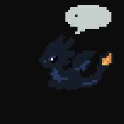

# Claude Cute



**[English](#english) · [Español](#español)**

---

## English

A desktop widget for Windows: a pixel-art dragon that floats above your windows
and reacts in real time to what your Claude Code session is doing.

Send it a prompt and it starts thinking. Run a tool and it breathes fire.
Finish, and it settles down.

### What it does

It reacts to Claude Code, telling apart up to **16 states**:

| State | When it shows up |
|---|---|
| `idle` / `idle-sleep` | Nothing going on; falls asleep after 5 minutes |
| `thinking` | Claude is reasoning |
| `working` + `-bash` `-edit` `-read` `-web` `-agent` | Using a tool, depending which |
| `waiting` | **Claude is waiting for you** |
| `done` | Finished answering |
| `error` / `error-api` | A command or the API failed |
| `wake` / `sleep` | The session starts or ends |
| `compacting` | Claude is compacting the context |

Each one has its own pixel-art animation. A state without sprites of its own
inherits its ancestor's, so a new character is viable with only a few folders
drawn. See [docs/SPRITES.md](docs/SPRITES.md).

Also:

- Floats above every other window, frameless and with a transparent background.
- Stays out of the taskbar and Alt+Tab, and leaves nothing next to the clock:
  it shows up with your session and goes away with it.
- Drags with the left button, and **remembers where you left it**.
- Right click on the avatar to force a state, pick a character, hide it for a
  while or quit.

### Requirements

- Windows (Linux with X11 should work, but see the table below)
- Python 3.10 or newer
- Claude Code (so the avatar reacts on its own; without it the widget still
  runs and states can be pushed by hand)

#### Where it runs

| Platform | |
|---|---|
| Windows | ✅ used daily |
| Claude Code in a terminal or an IDE | ✅ everything works |
| The Claude desktop app | ⚠️ needs one extra step — see [In the desktop app](#in-the-desktop-app) |
| Linux with X11 | ⚠️ **written for it, never run on it.** Nothing in the code touches Windows-only APIs and the launcher is there, but nobody has started this on a Linux desktop yet. Reports welcome |
| Linux with Wayland | ⬜ the dragon shows up and reacts, but **cannot be moved**: Wayland does not let a window place itself. Planned after the first release |
| macOS | ⬜ planned after the first release |

### Installation

From a terminal, in the project folder:

```bash
py -3 -m pip install -r requirements.txt
```

On Linux:

```bash
python3 -m pip install -r requirements.txt
```

### Starting it

On Windows, double click **`run.bat`**. On Linux, run **`run.sh`**:

```bash
bash run.sh
```

> Invoked as `bash run.sh` and not `./run.sh` on purpose: the executable bit
> does not survive a download, so telling you to `chmod` first would only add a
> step that fails silently if you skip it.

Or start it by hand:

```bash
pyw -3 main.py      # Windows
python3 main.py     # Linux
```

The avatar appears in the bottom-right corner and starts listening for events
on `127.0.0.1:8770`.

> **Why `pyw -3` and not `python` on Windows**: if you have several Pythons
> installed — the Microsoft Store alias, for instance — a bare `python` may
> pick the wrong one and fail with `ModuleNotFoundError: No module named
> 'PySide6'`. The Windows `py`/`pyw` launcher always picks the right one, and
> `pyw` also skips the console window.

Order does not matter: the widget and Claude Code are independent. Start either
first, and close and reopen either without breaking anything.

There can only be **one widget at a time**. Launch it again while one is open
and the second one says so and exits instead of stacking another dragon.

#### It comes and goes with your session

The dragon is part of the work environment, not a program you administer. When
the last Claude Code session is gone it waits five minutes —restarting the VS
Code extension closes and reopens a session within seconds— and then closes on
its own.

A widget you started by hand, that no session ever reached, stays until you
close it. That is what you want while drawing sprites.

#### Hiding it for a while

**Hide for** takes a deadline: 15 minutes, 1 hour or 4 hours. It comes back on
its own when the time is up, so there is no way to leave the widget running
invisible with nothing left to click.

There is a step for each intention: *Hide for* if you want it gone a while,
*Quit* if you want it gone now — it comes back with your next session.

#### Why a state sometimes gets "skipped"

During heavy work the events come every few hundred milliseconds, and a 600 ms
animation only managed to show two frames out of six: you could not tell what
it was.

So an animation with something to say reserves **two full cycles** before
another one may replace it. Once its turn is up it jumps straight to whatever
is true at that moment — there is no queue, so a very short state may never be
seen. That is deliberate: queueing would make the avatar fall behind without
bound during a burst, showing what happened half a minute ago.

Three exceptions, so aesthetics never beat information:

- **`waiting`, `error`, `done`, `wake` and `sleep` come in immediately.** They
  announce something that loses its value if it arrives late.
- **`idle` and `thinking` reserve nothing.** They are the filler between
  interesting things; protecting them would delay the reaction to a prompt and
  steal screen time from the tool animations.
- The real state is always available at `/state`, unsmoothed.

It is tuned with `MIN_CYCLES` in `src/smoothing.py`. At `0` it goes back to the
instant behaviour.

#### What it remembers between launches

A `config.json` next to the project stores the avatar's position, the chosen
character, and the port if it had to move. It can be
deleted with no consequences: everything goes back to its default.

If the saved position no longer lands inside any screen — after unplugging a
monitor, say — it is discarded and the avatar returns to the corner instead of
hiding out of sight.

> **Installed as a plugin, updating starts it fresh.** Each version gets its
> own folder, so the new one arrives without the previous `config.json` and the
> avatar returns to the corner with its default character. Only the
> preferences: nothing else is lost.

#### If it will not start

`run.bat` reports a missing `main.py`, a missing `py` launcher, or a PySide6
that will not import, showing the real error and waiting for you to read it.
The PySide6 check is a warning and not a barrier: if it fails, it tries to
start anyway.

If absolutely nothing happens, the most likely reason is that it is already
running — look for the dragon on screen, or close it with right click → Quit.

To see any error in full, run it with a console:

```bash
py -3 main.py
```

**`ModuleNotFoundError: No module named 'PySide6'`** even though you are sure
you installed it: check *where* it landed.

```bash
py -3 -c "import PySide6; print(PySide6.__file__)"
```

If the path contains `AppData\Local\Packages\...`, it is inside the private
storage of a packaged (MSIX) application and the rest of the system cannot see
it. Reinstall from a normal terminal.

### Connecting it to Claude Code

The avatar finds out what is going on through Claude Code's **hooks**:
*event → command* pairs that Claude Code runs automatically. There are two ways
to set them up.

#### As a plugin (two commands)

```
/plugin marketplace add EmmanuelUnsc/Claude-Cute
/plugin install claude-cute
```

It asks once how Python is started on your machine —`python3` is already filled
in; on Windows put `py`— and that is it. The hooks come with the plugin and
point at their own folder, so **moving or renaming the project cannot break
them**, which is the one failure the manual route has and cannot fix.

The plugin carries the program; the graphics library is fetched once, the
first time the dragon is asked for on a machine that does not already have it.

> **Conversations you already had open stay quiet.** Hooks are loaded when a
> session opens, so anything already running when you installed the plugin
> never got them. Open a new conversation, or reopen that one — resuming works
> too. Everything from then on reacts.

> **Coming from the manual setup? Remove those hooks first.** Otherwise every
> event fires twice: once from your `settings.json` and once from the plugin.
> Nothing breaks, but every tool call does the work twice.

#### In the desktop app

The Claude desktop app does not run the hooks a plugin declares
([claude-code#34573](https://github.com/anthropics/claude-code/issues/34573),
closed as not planned), so there the dragon neither starts nor reacts. In a
terminal and in the IDE extensions everything works.

Until that changes, one command registers the same hooks where the desktop app
does read them:

```bash
py install.py
```

It only adds what the plugin cannot deliver, so it sits alongside it instead of
duplicating anything. Every other setting in your `settings.json` is left as it
was, and a backup is written first. Open a new session for it to take effect.

To undo it:

```bash
py uninstall.py
```

> It records the full path of the Python you ran it with, and of this copy of
> the project. Move either of them and you run `py install.py` again.

#### By hand

For running from a clone, or if you would rather see exactly what gets
installed.

The configuration lives in `~/.claude/settings.json` — on Windows,
`C:\Users\YOUR-USER\.claude\settings.json`.

> **Merge it, do not replace it.** That file may already hold your own
> preferences (`model`, `theme`) and hooks from other tools. If you paste the
> block below over everything, you lose them. If the file does not exist yet,
> paste it as is; if it does, see the example at the end of this section.

Add the `hooks` section, replacing `PATH` with the absolute path to this
folder. **Keep the quotes around it**: the folder name has a space in it, and
without them Claude Code tries to run `Claude` as a program and the hook never
fires — silently, because these hooks are asynchronous.

On Linux or macOS, use `python3` instead of `py -3`.

```json
{
  "hooks": {
    "PreToolUse": [{ "matcher": "*", "hooks": [{ "type": "command", "command": "py -3 \"PATH/hooks/notify.py\"", "async": true }] }],
    "PostToolUse": [{ "matcher": "*", "hooks": [{ "type": "command", "command": "py -3 \"PATH/hooks/notify.py\"", "async": true }] }],
    "PostToolUseFailure": [{ "matcher": "*", "hooks": [{ "type": "command", "command": "py -3 \"PATH/hooks/notify.py\"", "async": true }] }],
    "PostToolBatch": [{ "matcher": "*", "hooks": [{ "type": "command", "command": "py -3 \"PATH/hooks/notify.py\"", "async": true }] }],
    "PermissionRequest": [{ "matcher": "*", "hooks": [{ "type": "command", "command": "py -3 \"PATH/hooks/notify.py\"", "async": true }] }],
    "PermissionDenied": [{ "matcher": "*", "hooks": [{ "type": "command", "command": "py -3 \"PATH/hooks/notify.py\"", "async": true }] }],
    "SessionStart": [{ "hooks": [{ "type": "command", "command": "py -3 \"PATH/hooks/notify.py\"", "async": true }] }],
    "UserPromptSubmit": [{ "hooks": [{ "type": "command", "command": "py -3 \"PATH/hooks/notify.py\"", "async": true }] }],
    "Notification": [{ "hooks": [{ "type": "command", "command": "py -3 \"PATH/hooks/notify.py\"", "async": true }] }],
    "SubagentStart": [{ "hooks": [{ "type": "command", "command": "py -3 \"PATH/hooks/notify.py\"", "async": true }] }],
    "SubagentStop": [{ "hooks": [{ "type": "command", "command": "py -3 \"PATH/hooks/notify.py\"", "async": true }] }],
    "TaskCreated": [{ "hooks": [{ "type": "command", "command": "py -3 \"PATH/hooks/notify.py\"", "async": true }] }],
    "TaskCompleted": [{ "hooks": [{ "type": "command", "command": "py -3 \"PATH/hooks/notify.py\"", "async": true }] }],
    "PreCompact": [{ "hooks": [{ "type": "command", "command": "py -3 \"PATH/hooks/notify.py\"", "async": true }] }],
    "PostCompact": [{ "hooks": [{ "type": "command", "command": "py -3 \"PATH/hooks/notify.py\"", "async": true }] }],
    "Stop": [{ "hooks": [{ "type": "command", "command": "py -3 \"PATH/hooks/notify.py\"", "async": true }] }],
    "StopFailure": [{ "hooks": [{ "type": "command", "command": "py -3 \"PATH/hooks/notify.py\"", "async": true }] }],
    "SessionEnd": [{ "hooks": [{ "type": "command", "command": "py -3 \"PATH/hooks/notify.py\"", "async": true }] }]
  }
}
```

The ones carrying `"matcher": "*"` are tool events; the rest do not need it.

**An event you do not register here never fires**, no matter how well the
widget knows what to do with it. Registering extra ones does no harm either: an
event your Claude Code version does not emit simply never happens.

The more events you register, the more states the avatar tells apart. With just
`UserPromptSubmit`, `PreToolUse`, `PostToolUse` and `Stop` the essentials
already work; the rest adds `waiting`, `error`, `wake`, `sleep` and
`compacting`.

`"async": true` matters: without it Claude Code **waits** for the hook to
finish before carrying on, and starting a Python interpreter costs about
180 ms. Since two hooks fire per tool, every tool call would pay almost four
tenths of a second of waiting. In the background that cost disappears: the
avatar does not need to answer before the tool, only shortly after.

The hook reads the event from stdin and POSTs it with a 400 ms budget. If the
widget is not running, it neither fails nor delays Claude Code.

> If you move or rename the project folder, remember to update the path here:
> the hooks stop working silently.

#### If your file already had things

`settings.json` is a single JSON object: the `hooks` section sits alongside the
rest of your preferences as one more key.

```json
{
  "model": "opus",
  "theme": "dark",
  "hooks": {
    "PreToolUse": [ ... ]
  }
}
```

And if you already had a hook on the same event, **you do not have to choose**:
each event is a list and one more group is added to it. Claude Code runs every
matching hook in parallel.

```json
"PreToolUse": [
  { "matcher": "*",    "hooks": [ { "type": "command", "command": "py -3 \"PATH/hooks/notify.py\"", "async": true } ] },
  { "matcher": "Bash", "hooks": [ { "type": "command", "command": "what-you-already-had.sh" } ] }
]
```

If the JSON ends up malformed, Claude Code ignores the **whole** file, and
silently. Run it through a JSON validator before saving.

#### What if a project has its own configuration?

It does not get in the way. Claude Code reads three files — the global one, the
project's (`.claude/settings.json`) and the local one
(`.claude/settings.local.json`) — and **merges** them. On top of that each
event is a list of groups, so a project's hooks are **added** to yours rather
than replacing them.

The only thing that turns hooks off is `"disableAllHooks": true` in any of
those files (or `allowManagedHooksOnly` in an organization-managed
configuration). If the avatar stops reacting in one project only, look for that
key before anything else.

#### If port 8770 is already taken

The widget listens on `127.0.0.1:8770`. If another program holds it, the widget
**moves to the next free port on its own** and records it in `config.json`. The
hook reads that same file, so nothing else is needed.

It only stops if what holds the port is another Claude Cute — that is the
single-instance control, and moving would quietly start a duplicate.

To pin a specific port, add it by hand:

```json
{ "port": 8771 }
```

### Testing without Claude Code

```bash
curl -X POST http://127.0.0.1:8770/event -H "Content-Type: application/json" -d "{\"state\":\"working\"}"
```

| Endpoint | Method | Body | Returns |
|---|---|---|---|
| `/event` | POST | `{"event": "PreToolUse", "tool": "Bash"}` or `{"state": "working"}` | `{"state": "..."}` |
| `/state` | GET | — | `{"state": "..."}` |

The `tool` field is optional and refines `PreToolUse`: `Bash` gives
`working-bash`, `Edit` gives `working-edit`, and so on.

The POST requires the `Content-Type: application/json` header. That is not red
tape: without it, any page you visit could POST to this port from your own
browser. The server only listens on `127.0.0.1` and caps the body at 8 KB.

### Project structure

```
Claude Cute/
├── main.py                  entry point: builds and wires everything
├── run.bat                  launcher, Windows
├── run.sh                   launcher, Linux
├── install.py               registers the hooks by hand, for the desktop app
├── uninstall.py             removes them again
├── requirements.txt
│
├── .claude-plugin/
│   ├── plugin.json          what the plugin is
│   └── marketplace.json     catalogue pointing at this same repository
│
├── src/
│   ├── server.py            local HTTP server that receives the events
│   ├── states.py            which states exist, what inherits from what
│   ├── state_manager.py     the live state machine; source of truth
│   ├── animation_engine.py  loads the PNGs and hands out the current frame
│   ├── character.py         reads and validates character.json
│   ├── avatar_window.py     the overlay window
│   ├── smoothing.py         how long each animation is held
│   ├── menu.py              the right-click menu
│   └── config.py            preferences that survive a restart
│
├── hooks/
│   ├── hooks.json           the 18 events, with no absolute paths
│   ├── launch.py            run at session start; makes sure it is running
│   └── notify.py            run by Claude Code; tells the widget
│
├── assets/<character>/<state>/frame_01.png …
└── tests/
```

### Characters

Each character is a folder inside `assets/`, with one subfolder per state and
an optional `character.json` setting its name, scale and speeds. If there is
more than one, pick it from **right click → Character**.

Adding one requires no code changes: drawing `idle/` is enough, because
everything else inherits.

The full guide — canvas, anchoring, palette, the list of states and what each
one represents — is in **[docs/SPRITES.md](docs/SPRITES.md)**.

While drawing, "Reload assets" in the context menu re-reads the PNGs from disk
without restarting the widget.

### Tests

```bash
py -3 -m unittest discover -s tests
```

They run in a few seconds and cover the state machine (event mapping,
inheritance, transitions, ordering, sessions, concurrency), the animation
engine (ancestor resolution, one-shot playback, characters), the HTTP server
(protocol, port selection), the hook, the preferences and the window. They run
headless and do not depend on the assets.

### Documentation

- **[docs/SPRITES.md](docs/SPRITES.md)** — everything needed to draw a
  character: canvas, anchoring, palette, budgets and the state list.
- **[docs/STATES.md](docs/STATES.md)** — what triggers each of the 16 states
  and how to reproduce it on purpose.

### What it touches, and how to leave

**Everything it touches is listed here.** Nothing else on your system is
modified.

| | |
|---|---|
| Claude Code's hooks | so it finds out what is happening |
| Its own folder | the sprites, and a `config.json` with the avatar's position |
| One port on loopback | 8770 by default, only reachable from your own machine |
| `~/.claude/claude-cute/` | **only if it had to fetch PySide6.** See below |

No registry keys, no autostart entries, and no outbound connections other than
that one download: the only socket the widget opens is a `listen` on
`127.0.0.1`.

#### About that one folder

The plugin carries the program, but it cannot carry the graphics library —
that is a hundred megabytes of platform-specific binaries. So the first time
the dragon is asked for on a machine without it, it fetches it once into
`~/.claude/claude-cute/`, and never again.

**Why not inside the plugin:** every plugin version gets a fresh folder, so
keeping it there would re-download those hundred megabytes on every update.

**The first launch takes a minute or two** while that happens, and the dragon
shows up when it is done. If it cannot be fetched — no network, no pip — there
is simply no dragon, and it will not keep retrying on every session. The reason
is written to `~/.claude/claude-cute/.install-failed`.

If you already have PySide6, none of this happens: the check costs a fifth of a
second and the folder is never created.

#### Uninstalling

If you installed the plugin:

```bash
claude plugin uninstall claude-cute@claude-cute
claude plugin marketplace remove claude-cute
```

From the desktop app, the **+** button next to the prompt box → *Plugins* →
*Manage plugins* does the same thing.

If you ran `py install.py` for the desktop app, undo it from the project
folder:

```bash
py uninstall.py
```

It removes only its own entries and leaves the rest of the file alone. If you
wrote the hooks in by hand instead, remove that block from
`~/.claude/settings.json` yourself, and delete the project folder.

**And if it ever fetched PySide6 for you**, that lives in one directory:

```bash
rm -rf ~/.claude/claude-cute
```

**The dragon closes itself.** If it is on screen when you uninstall, it stops
receiving events and goes away on its own about five minutes later, the same
way it does when you close your last session.

### License

MIT — see [LICENSE](LICENSE).

**The sprites too.** Dragoncita was drawn for this project by the author
credited in `assets/dragoncita/character.json`, and ships under the same
licence as the code. Anyone adding a character is expected to fill in that
`author` field with their own name.

---

## Español

> La interfaz del widget (el menú) está en inglés. Esta sección es la
> traducción de la de arriba.

Widget de escritorio para Windows: un dragón pixel art que se queda flotando
sobre tus ventanas y reacciona en tiempo real a lo que está haciendo tu sesión
de Claude Code.

Cuando le envías un prompt se pone a pensar. Cuando ejecuta una herramienta,
escupe fuego. Cuando termina, se relaja.

### Qué hace

Reacciona a lo que hace Claude Code, distinguiendo hasta **16 estados**:

| Estado | Cuándo aparece |
|---|---|
| `idle` / `idle-sleep` | No pasa nada; se duerme a los 5 minutos |
| `thinking` | Claude está razonando |
| `working` + `-bash` `-edit` `-read` `-web` `-agent` | Usando una herramienta, según cuál |
| `waiting` | **Claude está esperando tu aprobación** |
| `done` | Terminó de responder |
| `error` / `error-api` | Falló un comando o la API |
| `wake` / `sleep` | Arranca o termina la sesión |
| `compacting` | Claude está compactando el contexto |

Cada uno tiene su propia animación pixel art. Un estado sin sprites propios
heredaría los de su ancestro, así que un personaje nuevo es viable dibujando
sólo unos pocos. Ver [docs/SPRITES.md](docs/SPRITES.md).

Además:

- Flota siempre encima de las demás ventanas, sin bordes y con fondo
  transparente.
- No aparece en la barra de tareas ni en Alt+Tab, y no deja nada junto al
  reloj: aparece con tu sesión y se va con ella.
- Se arrastra con el botón izquierdo, y **recuerda dónde lo dejaste**.
- Con click derecho sobre el avatar se fuerza un estado, se elige personaje, se
  oculta un rato o se sale.

### Requisitos

- Windows (Linux con X11 debería andar, pero mirá la tabla de abajo)
- Python 3.10 o superior
- Claude Code (para que el avatar reaccione solo; sin él, el widget igual corre
  y se le pueden empujar estados a mano)

#### Dónde corre

| Plataforma | |
|---|---|
| Windows | ✅ de uso diario |
| Claude Code en terminal o en un IDE | ✅ funciona todo |
| La app de escritorio de Claude | ⚠️ necesita un paso extra — ver [En la app de escritorio](#en-la-app-de-escritorio) |
| Linux con X11 | ⚠️ **escrito para funcionar ahí, nunca ejecutado ahí.** Nada del código usa APIs exclusivas de Windows y el lanzador está hecho, pero nadie arrancó esto todavía en un escritorio Linux. Se agradecen reportes |
| Linux con Wayland | ⬜ el dragón aparece y reacciona, pero **no se puede mover**: Wayland no deja que una ventana se posicione sola. Previsto para después del primer lanzamiento |
| macOS | ⬜ previsto para después del primer lanzamiento |

### Instalación

Desde una terminal, en la carpeta del proyecto:

```bash
py -3 -m pip install -r requirements.txt     # Windows
python3 -m pip install -r requirements.txt   # Linux
```

La única dependencia es PySide6.

Para comprobar que quedó bien instalado:

```bash
py -3 -c "import PySide6; print(PySide6.__file__)"
```

### Cómo se inicia

En Windows, doble click en **`run.bat`**. En Linux, se corre **`run.sh`**:

```bash
bash run.sh
```

> Se invoca con `bash run.sh` y no con `./run.sh` a propósito: el permiso de
> ejecución no sobrevive a una descarga, así que pedirte un `chmod` antes sólo
> agregaría un paso que falla en silencio si se lo omite.

O a mano:

```bash
pyw -3 main.py      # Windows
python3 main.py     # Linux
```

El avatar aparece en la esquina inferior derecha y queda escuchando eventos en
`127.0.0.1:8770`.

> **Por qué `pyw -3` y no `python`**: si tienes varios Python instalados — el
> alias de Microsoft Store, por ejemplo — `python` a secas puede agarrar el
> equivocado y fallar con `ModuleNotFoundError: No module named 'PySide6'`. El
> launcher `py`/`pyw` de Windows siempre elige el correcto. `pyw` además evita
> la ventana de consola.

No importa el orden: el widget y Claude Code son independientes. Puedes abrir
cualquiera primero, y cerrar y reabrir cualquiera de los dos sin romper nada.

Sólo puede haber **un widget a la vez**. Si se lanza de nuevo estando abierto,
el segundo avisa y se cierra en vez de apilar otro dragón.

#### Viene y se va con tu sesión

El dragón es parte del entorno de trabajo, no un programa que haya que
administrar. Cuando se fue la última sesión de Claude Code espera cinco minutos
—reiniciar la extensión de VS Code cierra y reabre una sesión en segundos— y se
cierra solo.

Un widget que abriste a mano, al que nunca se le acercó una sesión, se queda
hasta que lo cierres. Es lo que hace falta para dibujar sprites.

#### Ocultarlo un rato

**Hide for** pide un plazo: 15 minutos, 1 hora o 4 horas. Vuelve solo al
cumplirse, así que no hay forma de dejar el widget corriendo invisible sin nada
que clickear para recuperarlo.

Hay un escalón para cada intención: *Hide for* si lo quieres lejos un rato,
*Quit* si lo quieres lejos ahora — vuelve en tu próxima sesión.

#### Por qué a veces "se salta" un estado

Durante el trabajo intenso los eventos se suceden cada pocos cientos de
milisegundos, y una animación de 600 ms alcanzaba a mostrar dos frames de seis:
no se llegaba a ver qué era.

Por eso una animación con algo que contar se reserva **dos vueltas completas**
antes de que otra pueda reemplazarla. Cuando cumple su turno, salta directo a
lo que sea verdad en ese momento — no hay cola, así que un estado muy breve
puede no verse nunca. Es deliberado: encolar haría que el avatar se atrasara
sin techo en una ráfaga, mostrando lo que pasó hace medio minuto.

Tres excepciones, para que la estética no le gane a la información:

- **`waiting`, `error`, `done`, `wake` y `sleep` entran de inmediato.** Avisan
  algo que pierde valor si llega tarde.
- **`idle` y `thinking` no reservan nada.** Son el relleno entre cosas
  interesantes; protegerlos retrasaría la reacción al prompt y le robaría
  pantalla a las animaciones de herramienta.
- El estado real siempre está disponible en `/state`, sin suavizar.

Se ajusta con `MIN_CYCLES` en `src/smoothing.py`. En `0` vuelve al
comportamiento instantáneo.

#### Qué recuerda entre arranques

Un `config.json` junto al proyecto guarda la posición del avatar, el personaje
elegido y el puerto, si tuvo que mudarse. Se puede borrar sin consecuencias: vuelve a los
valores por defecto.

Si la posición guardada ya no cae dentro de ninguna pantalla —por ejemplo tras
desconectar un monitor— se descarta y el avatar vuelve a la esquina, en vez de
quedar escondido fuera de la vista.

> **Instalado como plugin, actualizar lo deja como nuevo.** Cada versión
> estrena carpeta, así que la nueva llega sin el `config.json` anterior y el
> avatar vuelve a la esquina con su personaje por defecto. Sólo las
> preferencias: no se pierde nada más.

#### Si no arranca

`run.bat` avisa si falta `main.py`, si falta el launcher `py` o si no puede
importar PySide6, mostrando el error real y esperando a que lo leas. La
verificación de PySide6 es una advertencia, no una barrera: si falla, intenta
arrancar igual.

Si no pasa absolutamente nada, lo más probable es que ya esté corriendo —
buscá el dragón en la pantalla, o cerralo con click derecho → Quit.

Para ver cualquier error completo, ejecútalo con consola:

```bash
py -3 main.py
```

**`ModuleNotFoundError: No module named 'PySide6'`** aunque parezca
haberlo instalado: revisa *dónde* quedó instalado.

```bash
py -3 -c "import PySide6; print(PySide6.__file__)"
```

Si la ruta contiene `AppData\Local\Packages\...`, está dentro del
almacenamiento privado de una aplicación empaquetada (MSIX) y el resto del
sistema no lo ve. Reinstalalo desde una terminal normal. El caso concreto que
motivó esta nota: un `pip install` corrido por un agente dentro del contenedor
de la app de escritorio de Claude — funcionaba ahí y no en Windows.

### Conectar con Claude Code

El avatar se entera de lo que pasa a través de los **hooks** de Claude Code:
pares *evento → comando* que Claude Code ejecuta automáticamente. Hay dos
formas de dejarlos andando.

#### Como plugin (dos comandos)

```
/plugin marketplace add EmmanuelUnsc/Claude-Cute
/plugin install claude-cute
```

Pregunta una sola vez cómo se llama Python en tu máquina —`python3` ya viene
puesto; en Windows va `py`— y listo. Los hooks vienen con el plugin y apuntan a
su propia carpeta, así que **mover o renombrar el proyecto ya no puede
romperlos**, que es la única falla que la instalación manual no puede evitar.

El plugin trae el programa; la biblioteca gráfica se baja una sola vez, la primera
vez que se pide el dragón en una máquina que no la tiene.

> **Las conversaciones que ya estaban abiertas quedan mudas.** Los hooks se
> cargan al abrir una sesión, así que lo que estaba corriendo cuando instalaste
> el plugin nunca los recibió. Abre una conversación nueva, o vuelve a abrir
> esa — reanudar también funciona. De ahí en adelante todo reacciona.

> **¿Vienes de la instalación manual? Quita esos hooks primero.** Si no, cada
> evento sale dos veces: uno desde tu `settings.json` y otro desde el plugin.
> No rompe nada, pero duplica el trabajo en cada llamada a herramienta.

#### En la app de escritorio

La app de escritorio de Claude no ejecuta los hooks que declara un plugin
([claude-code#34573](https://github.com/anthropics/claude-code/issues/34573),
cerrado como *not planned*), así que ahí el dragón ni arranca ni reacciona. En
una terminal y en las extensiones de IDE funciona todo.

Hasta que eso cambie, un comando registra los mismos hooks donde la app sí los
lee:

```bash
py install.py
```

Agrega sólo lo que el plugin no logra entregar, así que convive con él en vez
de duplicar nada. Todo lo demás de tu `settings.json` queda como estaba, y
antes de tocarlo se guarda una copia. Abre una sesión nueva para que tome
efecto.

Para deshacerlo:

```bash
py uninstall.py
```

> Anota la ruta completa del Python con que se ejecutó y la de esta copia
> del proyecto. Si se mueve cualquiera de las dos, hay que volver a
> ejecutar `py install.py`.

#### A mano

Para correr desde una copia del código, o si prefieres ver exactamente qué se
instala.

La configuración vive en `~/.claude/settings.json` — en Windows,
`C:\Users\TU-USUARIO\.claude\settings.json`.

> **Fusionalo, no lo reemplaces.** Ese archivo puede tener ya preferencias
> tuyas (`model`, `theme`) y hooks de otras herramientas. Si pegas el bloque de
> abajo encima de todo, se pierden. Si el archivo todavía no existe, pégalo tal
> cual; si ya existe, mirá el ejemplo al final de esta sección.

Agregá la sección `hooks`, reemplazando `RUTA` por la ruta absoluta a esta
carpeta. **Dejá las comillas alrededor**: el nombre de la carpeta tiene un
espacio, y sin ellas Claude Code intenta ejecutar `Claude` como si fuera un
programa y el hook no corre nunca — en silencio, porque estos hooks son
asincrónicos.

En Linux o macOS va `python3` en lugar de `py -3`.

```json
{
  "hooks": {
    "PreToolUse": [{ "matcher": "*", "hooks": [{ "type": "command", "command": "py -3 \"RUTA/hooks/notify.py\"", "async": true }] }],
    "PostToolUse": [{ "matcher": "*", "hooks": [{ "type": "command", "command": "py -3 \"RUTA/hooks/notify.py\"", "async": true }] }],
    "PostToolUseFailure": [{ "matcher": "*", "hooks": [{ "type": "command", "command": "py -3 \"RUTA/hooks/notify.py\"", "async": true }] }],
    "PermissionRequest": [{ "matcher": "*", "hooks": [{ "type": "command", "command": "py -3 \"RUTA/hooks/notify.py\"", "async": true }] }],
    "SessionStart": [{ "hooks": [{ "type": "command", "command": "py -3 \"RUTA/hooks/notify.py\"", "async": true }] }],
    "UserPromptSubmit": [{ "hooks": [{ "type": "command", "command": "py -3 \"RUTA/hooks/notify.py\"", "async": true }] }],
    "Notification": [{ "hooks": [{ "type": "command", "command": "py -3 \"RUTA/hooks/notify.py\"", "async": true }] }],
    "SubagentStart": [{ "hooks": [{ "type": "command", "command": "py -3 \"RUTA/hooks/notify.py\"", "async": true }] }],
    "SubagentStop": [{ "hooks": [{ "type": "command", "command": "py -3 \"RUTA/hooks/notify.py\"", "async": true }] }],
    "PreCompact": [{ "hooks": [{ "type": "command", "command": "py -3 \"RUTA/hooks/notify.py\"", "async": true }] }],
    "PostCompact": [{ "hooks": [{ "type": "command", "command": "py -3 \"RUTA/hooks/notify.py\"", "async": true }] }],
    "Stop": [{ "hooks": [{ "type": "command", "command": "py -3 \"RUTA/hooks/notify.py\"", "async": true }] }],
    "StopFailure": [{ "hooks": [{ "type": "command", "command": "py -3 \"RUTA/hooks/notify.py\"", "async": true }] }],
    "SessionEnd": [{ "hooks": [{ "type": "command", "command": "py -3 \"RUTA/hooks/notify.py\"", "async": true }] }],
    "PermissionDenied": [{ "matcher": "*", "hooks": [{ "type": "command", "command": "py -3 \"RUTA/hooks/notify.py\"", "async": true }] }],
    "PostToolBatch": [{ "matcher": "*", "hooks": [{ "type": "command", "command": "py -3 \"RUTA/hooks/notify.py\"", "async": true }] }],
    "TaskCreated": [{ "hooks": [{ "type": "command", "command": "py -3 \"RUTA/hooks/notify.py\"", "async": true }] }],
    "TaskCompleted": [{ "hooks": [{ "type": "command", "command": "py -3 \"RUTA/hooks/notify.py\"", "async": true }] }]
  }
}
```

Los que llevan `"matcher": "*"` son eventos de herramienta; el resto no lo
necesita.

**Un evento que no registres acá no se dispara nunca**, por más que el widget
sepa qué hacer con él. Registrar de más tampoco molesta: un evento que tu
versión de Claude Code no emita simplemente no ocurre.

Cuantos más eventos registres, más estados distingue el avatar. Con sólo
`UserPromptSubmit`, `PreToolUse`, `PostToolUse` y `Stop` ya funciona lo
esencial; el resto suma `waiting`, `error`, `wake`, `sleep` y `compacting`.

#### Si tu archivo ya tenía cosas

`settings.json` es un solo objeto JSON: la sección `hooks` convive con el resto
de tus preferencias como una clave más.

```json
{
  "model": "opus",
  "theme": "dark",
  "hooks": {
    "PreToolUse": [ ... ]
  }
}
```

Y si ya había un hook en el mismo evento, **no hay que elegir**: cada evento
es una lista y se le agrega un grupo más. Claude Code ejecuta en paralelo todos
los que coincidan.

```json
"PreToolUse": [
  { "matcher": "*",    "hooks": [ { "type": "command", "command": "py -3 \"RUTA/hooks/notify.py\"", "async": true } ] },
  { "matcher": "Bash", "hooks": [ { "type": "command", "command": "lo-que-ya-tenias.sh" } ] }
]
```

Si el JSON queda mal formado, Claude Code ignora el archivo **entero** y sin
avisar. Conviene pasarlo por un validador de JSON antes de guardar.

Listo. Abrí una sesión de Claude Code y el dragón empieza a moverse solo.

> **Sólo reacciona a Claude Code, no al chat de Claude.** Los hooks son una
> funcionalidad de Claude Code: viven en su `settings.json` y los ejecuta él.
> El chat no ejecuta comandos locales, así que no hay nada de dónde colgarse.
> Tampoco reacciona a sesiones en la nube, porque ahí el hook correría en el
> entorno remoto y el POST nunca llegaría a tu máquina.
>
> Como el widget escucha HTTP, cualquier otra cosa capaz de hacer un POST puede
> manejarlo: un build largo, una suite de tests, un deploy.

El hook lee el evento por stdin y hace un POST con timeout de 400 ms. Si el
widget no está corriendo, no falla ni demora a Claude Code.

`"async": true` es importante: sin eso Claude Code **espera** a que el hook
termine antes de seguir, y arrancar un intérprete de Python cuesta unos 180 ms.
Como se disparan dos hooks por herramienta, cada tool call pagaría casi
cuatro décimas de segundo de espera. En segundo plano el costo desaparece: el
avatar no necesita responder antes que la herramienta, sólo poco después.

> Si mueves o renombras la carpeta del proyecto, recuerda actualizar la ruta
> acá: los hooks dejan de funcionar en silencio.

#### ¿Y si un proyecto tiene su propia configuración?

No molesta. Claude Code lee tres archivos —el global, el del proyecto
(`.claude/settings.json`) y el local (`.claude/settings.local.json`)— y los
**combina**. Además cada evento es una lista de grupos, así que los hooks de un
proyecto se **suman** a los tuyos en vez de reemplazarlos.

Está comprobado además de documentado: durante las pruebas se registró un hook
de proyecto para los mismos eventos que ya tenía el global, y **los dos se
dispararon en cada tool call**, cada uno con su propio payload.

Lo único que apaga los hooks es `"disableAllHooks": true` en cualquiera de esos
archivos (o `allowManagedHooksOnly` en una configuración administrada por una
organización). Si el avatar deja de reaccionar sólo en un proyecto, buscá esa
clave antes que cualquier otra cosa.

#### Si el puerto 8770 ya está ocupado

El widget escucha en `127.0.0.1:8770`. Si otro programa lo tiene tomado, al
arrancar te lo va a decir —distingue entre "ya hay un Claude Cute" y "hay un
extraño"— y puedes elegir otro agregando una línea a `config.json`, junto a
`main.py`:

```json
{ "puerto": 8771 }
```

El hook lee ese mismo archivo, así que con cambiarlo una vez alcanza.

### Probar sin Claude Code

```bash
curl -X POST http://127.0.0.1:8770/event -H "Content-Type: application/json" -d "{\"state\":\"working\"}"
```

| Endpoint | Método | Body | Devuelve |
|---|---|---|---|
| `/event` | POST | `{"event": "PreToolUse", "tool": "Bash"}` o `{"state": "working"}` | `{"state": "..."}` |
| `/state` | GET | — | `{"state": "..."}` |

El campo `tool` es opcional y refina `PreToolUse`: `Bash` da `working-bash`,
`Edit` da `working-edit`, y así.

El POST exige la cabecera `Content-Type: application/json`. No es capricho:
sin eso, cualquier página que visites podría hacerle un POST a este puerto
desde tu propio navegador. El servidor sólo escucha en `127.0.0.1` y limita el
cuerpo a 8 KB.

### Estructura del proyecto

```
Claude Cute/
├── main.py                  punto de entrada: arma y conecta todo
├── run.bat                  lanzador, Windows
├── run.sh                   lanzador, Linux
├── install.py               registra los hooks a mano, para la app de escritorio
├── uninstall.py             los vuelve a quitar
│
├── .claude-plugin/
│   ├── plugin.json          qué es el plugin
│   └── marketplace.json     catálogo que apunta a este mismo repositorio
├── requirements.txt
│
├── src/
│   ├── server.py            servidor HTTP local que recibe los eventos
│   ├── states.py            qué estados hay, quién hereda de quién
│   ├── state_manager.py     máquina de estados; fuente de verdad
│   ├── animation_engine.py  carga los PNG y entrega el frame que toca
│   ├── character.py         lee y valida el character.json
│   ├── avatar_window.py     la ventana overlay
│   ├── smoothing.py         cuánto se deja ver cada animación
│   ├── menu.py              el menú del click derecho
│   └── config.py            preferencias que sobreviven al reinicio
│
├── hooks/
│   ├── hooks.json           los 18 eventos, sin rutas absolutas
│   ├── launch.py            corre al abrir sesión; se asegura de que esté vivo
│   └── notify.py            lo ejecuta Claude Code; avisa al widget
│
├── assets/
│   └── dragoncita/          un personaje = una carpeta
│       ├── personaje.json   nombre, escala, velocidades
│       ├── idle/  thinking/  working/  done/   …y el resto de estados
│
├── tests/                   máquina de estados y motor de animación
│
└── docs/
    ├── SPRITES.md           cómo dibujar un personaje
    └── STATES.md            qué dispara cada estado
```

### Personajes

Cada personaje es una carpeta dentro de `assets/`, con una subcarpeta por
estado y un `character.json` opcional que fija su nombre, escala y
velocidades. Si hay más de uno, se elige desde **click derecho → Character**.

Agregar uno no requiere tocar código: alcanza con dibujar `idle/`, porque todo
lo demás hereda.

La guía completa —lienzo, anclaje, paleta, la lista de estados con lo que
representa cada uno— está en **[docs/SPRITES.md](docs/SPRITES.md)**.

Mientras dibujas, "Reload assets" del menú contextual relee los PNG del
disco sin reiniciar el widget.

### Tests

```bash
py -3 -m unittest discover -s tests
```

Tardan unos segundos. Cubren la máquina de estados (mapeo de
eventos, herencia, transiciones, orden, sesiones, concurrencia), el motor de
animación (resolución por ancestros, una sola pasada, personajes), las
preferencias que sobreviven al reinicio y la ventana (posición recordada,
visibilidad, menú, espera mínima). Corren sin pantalla y sin depender de los
assets.

### Documentación

- **[docs/SPRITES.md](docs/SPRITES.md)** — cómo dibujar un personaje: formato,
  anclaje, paleta y la lista de estados.
- **[docs/STATES.md](docs/STATES.md)** — qué dispara cada uno de los 16
  estados y cómo provocarlo a propósito para probarlo.

### Estado

Funciona de punta a punta: los dieciséis estados dibujados, el widget que
aparece y se va con tu sesión, las preferencias que sobreviven al reinicio, el
plugin instalable con un comando y la suite de tests en verde.

Lo que se sabe que falta:

- **La app de escritorio de Claude no ejecuta los hooks de un plugin**
  ([claude-code#34573](https://github.com/anthropics/claude-code/issues/34573)).
  Hasta que cambie, ahí hace falta `py install.py`.
- **Varias sesiones comparten un único avatar** y gana el último evento, con
  dos excepciones: un aviso pendiente de otra sesión no se pisa, y cerrar una
  ventana sólo duerme al avatar si era la última viva.
- **Linux está escrito pero nunca probado**, y en Wayland el avatar no se puede
  mover: el sistema no deja que una ventana se ubique sola.
- **macOS**, sin probar.

### Qué toca, y cómo irse

**Todo lo que toca está en esta lista.** Nada más de tu sistema se modifica.

| | |
|---|---|
| Los hooks de Claude Code | para enterarse de lo que pasa |
| Su propia carpeta | los sprites, y un `config.json` con la posición del avatar |
| Un puerto en loopback | el 8770 por defecto, alcanzable sólo desde tu máquina |
| `~/.claude/claude-cute/` | **sólo si tuvo que bajar PySide6.** Ver abajo |

Ni claves del registro, ni entradas de inicio automático, ni conexiones
salientes más allá de esa descarga: el único socket que abre el widget es un
`listen` en `127.0.0.1`.

#### Sobre esa carpeta

El plugin trae el programa, pero no puede traer la biblioteca gráfica: son cien
megas de binarios distintos para cada sistema. Así que la primera vez que se
pide el dragón en una máquina que no la tiene, la baja una vez a
`~/.claude/claude-cute/` y nunca más.

**Por qué no adentro del plugin:** cada versión estrena carpeta, así que
tenerla ahí significaría volver a bajar esos cien megas en cada actualización.

**El primer arranque tarda un minuto o dos** mientras eso pasa, y el dragón
aparece cuando termina. Si no se puede —sin internet, sin pip— simplemente no
hay dragón, y no reintenta en cada sesión: el motivo queda escrito en
`~/.claude/claude-cute/.install-failed`.

Si ya tienes PySide6, nada de esto ocurre: la comprobación cuesta dos décimas de
segundo y la carpeta no se crea nunca.

#### Desinstalar

Si instalaste el plugin:

```bash
claude plugin uninstall claude-cute@claude-cute
claude plugin marketplace remove claude-cute
```

Desde la app de escritorio es lo mismo con el botón **+** al lado del cuadro de
texto → *Plugins* → *Manage plugins*.

Si ejecutaste `py install.py` para la app de escritorio, deshazlo desde la
carpeta del proyecto:

```bash
py uninstall.py
```

Saca solamente sus propias entradas y deja el resto del archivo intacto. Si en
cambio escribiste los hooks a mano, sacá ese bloque de
`~/.claude/settings.json` a mano, y borra la carpeta del proyecto.

**Y si alguna vez te bajó PySide6**, eso vive en una sola carpeta:

```bash
rm -rf ~/.claude/claude-cute
```

**El dragón se cierra solo.** Si estaba en pantalla al desinstalar, deja de
recibir eventos y se va a los cinco minutos, igual que cuando cierras tu última
sesión.

### Licencia

MIT. Ver [LICENSE](LICENSE).

**Los sprites también.** La dragoncita se dibujó para este proyecto, con el
crédito en `assets/dragoncita/character.json`, y va bajo la misma licencia que
el código. Quien agregue un personaje completa ese campo `author` con su
nombre.
